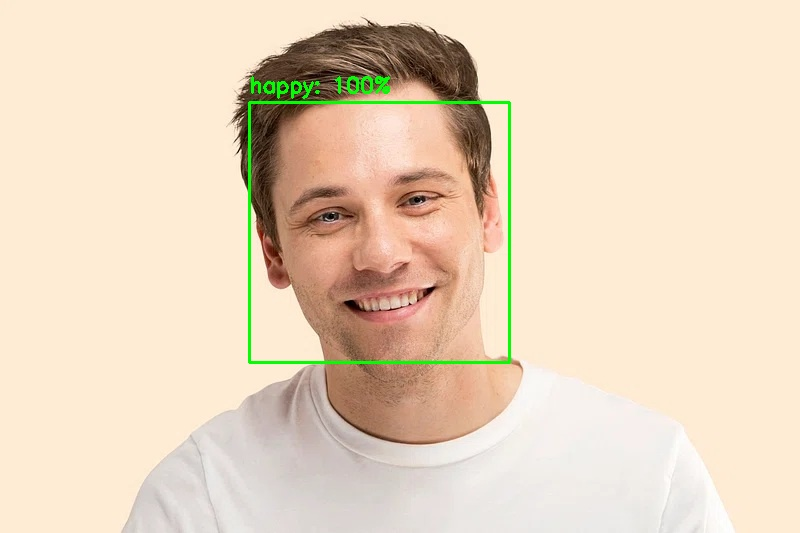

# Real-Time Emotion Detection System

A machine learning pipeline for real-time facial emotion detection using DeepFace and OpenCV. Detects faces and classifies emotions with colour-coded bounding boxes and confidence scores.


## 📋 Overview

This project demonstrates an end-to-end emotion detection system capable of:
- Detecting faces in static images or live webcam feed
- Classifying emotions across 7 categories: happy, sad, angry, surprised, fearful, disgusted, neutral
- Displaying colour-coded bounding boxes based on detected emotion
- Printing a full emotion breakdown with a visual confidence bar chart in the terminal
- Running real-time inference via webcam

Designed to simulate human-computer interaction systems, mental health monitoring tools, and customer experience analytics pipelines.

## 🖼️ Sample Output



## 🎨 Emotion Colour Mapping

| Emotion | Colour |
|---|---|
| Happy | 🟢 Green |
| Sad | 🔵 Blue |
| Angry | 🔴 Red |
| Surprise | 🟡 Yellow |
| Fear | 🟣 Purple |
| Disgust | 🌲 Dark Green |
| Neutral | ⚪ White |

## 🛠️ Tech Stack

- **Python** — Core language
- **DeepFace** — Facial emotion analysis model
- **TensorFlow / tf-keras** — Deep learning backend
- **OpenCV** — Image processing and visualization

## 📁 Project Structure

```
emotion-detection/
│
├── main.py               # Entry point — run detection on image or webcam
├── detector.py           # EmotionDetector class wrapping DeepFace
├── utils.py              # Helper functions for drawing and image I/O
├── requirements.txt      # Project dependencies
├── sample_images/        # Test images
└── results/              # Output images with detections
```

## 🚀 Getting Started

### 1. Clone the repository
```bash
git clone https://github.com/aknashwin/emotion-detection.git
cd emotion-detection
```

### 2. Create and activate virtual environment
```bash
python -m venv venv
venv\Scripts\activate  # Windows
source venv/bin/activate  # Mac/Linux
```

### 3. Install dependencies
```bash
pip install -r requirements.txt
```

### 4. Run detection on an image
```bash
python main.py --mode image --input sample_images/test.jpg
```

### 5. Run real-time webcam detection
```bash
python main.py --mode webcam
```

## ⚙️ Arguments

| Argument | Default | Description |
|---|---|---|
| `--mode` | `image` | `image` or `webcam` |
| `--input` | `sample_images/test.jpg` | Path to input image |
| `--output` | `results/output.jpg` | Path to save output |
| `--confidence` | `10` | Minimum confidence threshold (0-100) |

## 📊 Example Terminal Output

```
Faces detected: 1

  Face 1:
    Dominant emotion : happy (99.8%)
    All emotions:
      happy       99.8%  ███████████████████
      neutral      0.2%  
      angry        0.0%  
      disgust      0.0%  
      fear         0.0%  
      sad          0.0%  
      surprise     0.0%  
```

## 🔮 Future Improvements

- Add support for multiple face detection in group photos
- Implement emotion tracking over time in video files
- Build a Streamlit dashboard for live emotion analytics
- Extend to age and gender detection using DeepFace's full capabilities
- Export emotion data to CSV for downstream analysis
```
